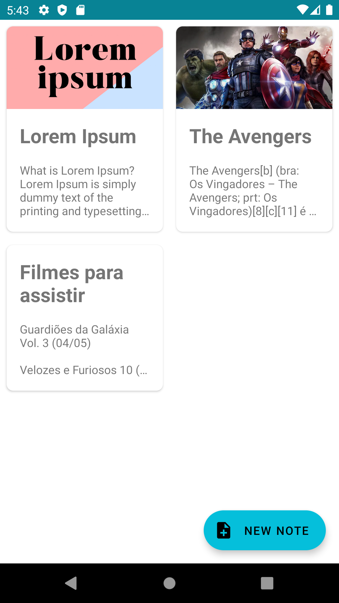
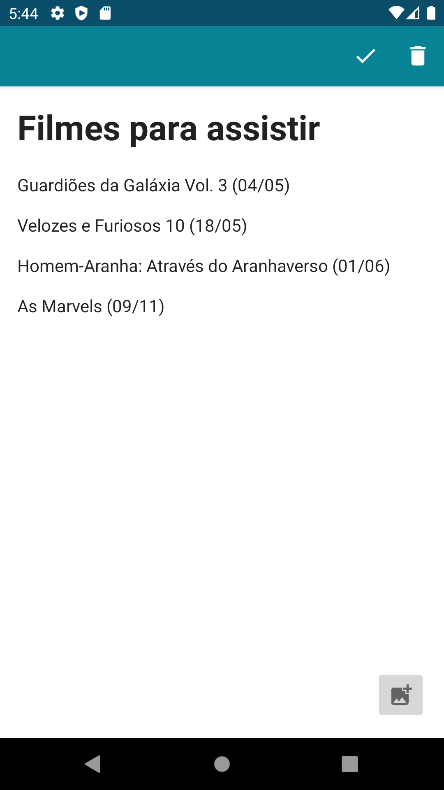

# AppNotes

Aplicativo de notas, criado para exercitar um CRUD com uma webApi

| Lista de comptas                   | Inserir valor do produto                         | Opçẽs para inserir produto                     |
|------------------------------------|--------------------------------------------------|------------------------------------------------|
|  |  |  |

Ultilizados:
* KOTLIN (linguagem de progração)
* XML (contrução de layouts)
* ACTIVITYS (logica das telas)
* COROUTINES (executar tarefas fora da thread principal)
* REPOSITORY (gerenciar atualizações entre o room e a webApi)
* Retrofit (cominicação com a webApi)
* ROOM (salvar os dados localmente)